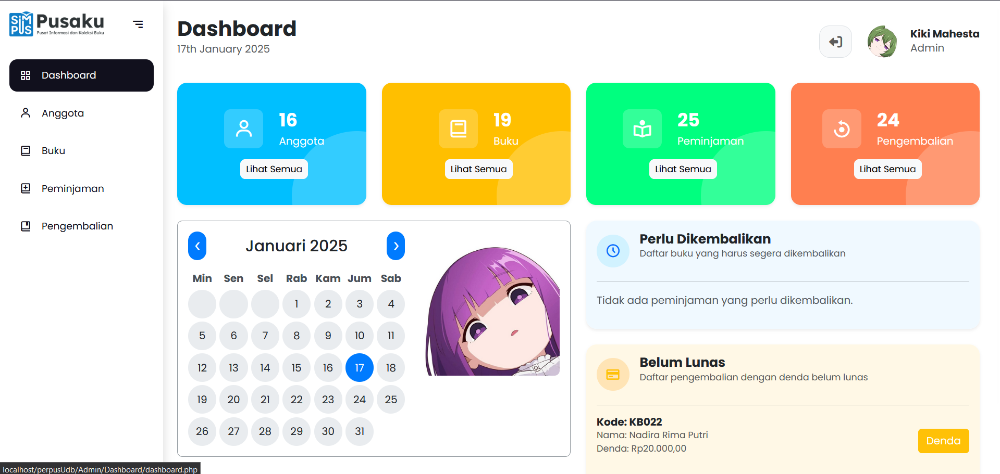

# 🌟 **Pusaku - Pusat Informasi & Koleksi Buku**

> Sistem Informasi Perpustakaan Modern untuk Universitas

---



## 📖 **Deskripsi Proyek**

**Pusaku** adalah sistem informasi berbasis web yang dirancang untuk mempermudah pengelolaan perpustakaan.  
Dibangun menggunakan **PHP Native** dan **Bootstrap 5**, proyek ini menawarkan solusi modern untuk manajemen perpustakaan.

### ✨ **Fitur Utama:**

- **Manajemen Buku**: Tambah, edit, dan hapus koleksi buku.
- **Peminjaman dan Pengembalian**: Kelola transaksi dengan mudah.
- **Pengelolaan Pengguna**: Mendukung 3 jenis pengguna dengan akses berbeda:
  - 👑 **Owner**: Pemilik sistem yang dapat menambahkan admin.
  - 🛠️ **Admin**: Mengelola buku, peminjaman, dan pengembalian.
  - 📚 **User**: Mahasiswa yang dapat meminjam buku.

---

## 🎯 **Fitur Lengkap**

### 👑 **Untuk Owner:**

- ✏️ Menambahkan, mengedit, dan menghapus akun admin.
- 📊 Melihat laporan peminjaman dan pengembalian buku secara keseluruhan.
- 📈 Mengelola data statistik perpustakaan.

### 🛠️ **Untuk Admin:**

- 📚 Menambahkan, mengedit, dan menghapus data buku.
- 🔄 Mengelola data peminjaman dan pengembalian buku.
- 👥 Melihat daftar peminjam aktif dan status pengembalian.
- 💰 Mengatur denda untuk pengembalian terlambat.

### 📚 **Untuk User:**

- 🔑 Melakukan registrasi dan login.
- 🔍 Mencari buku berdasarkan kategori, judul, atau penulis.
- 📖 Melihat detail buku (stok, deskripsi, tahun terbit).
- 📝 Mengajukan peminjaman buku.
- 📜 Melihat riwayat peminjaman dan status pengembalian.

---

## 🛠️ **Teknologi yang Digunakan**

| Teknologi    | Deskripsi                          |
| ------------ | ---------------------------------- |
| **Frontend** | Bootstrap 5 untuk antarmuka modern |
| **Backend**  | PHP Native untuk pemrosesan data   |
| **Database** | MySQL untuk penyimpanan data       |
| **Server**   | Hosting lokal atau Apache          |

---

## 📁 **Struktur Folder**

```plaintext
Pusaku/
├── assets/              # File CSS, JS, dan gambar
├── database/            # Skrip SQL untuk inisialisasi database
├── includes/            # File PHP untuk koneksi database dan fungsi umum
├── views/               # File HTML/PHP untuk antarmuka pengguna
├── controllers/         # File logika backend
├── index.php            # Halaman utama aplikasi
└── README.md            # Dokumentasi proyek
```
